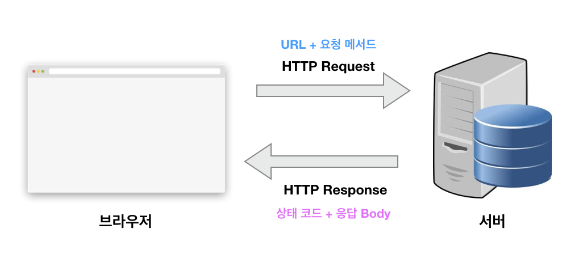

# HTTP 프로토콜

## HTTP 프로토콜 이란?

- Hypertext Transfer Protocol은 통신 프로토콜로, 프로토콜이랑 상호간에 정의한 규칙을 의미하며 특정 기기 간에 데이터를 주고받기 위해 정의되었다.

- 웹에서는 브라우저와 서버 간에 데이터를 주고받기 위한 방식으로, HTTP 프로토콜을 사용하고 있다.

## HTTP 프로토콜 특징

- HTTP 프로토콜은 데이터를 주고 받기 위한 각각의 데이터 요청이, 서로 독립적으로 관리가 가능하다.

- 이전 데이터 요청과 앞으로의 데이터 요청이 서로 관련이 없기 때문에, 서버는 세션과 같은 별도의 추가 정보를 관리하지 않아도 되고, 다수의 요청 처리 및 서버의 부하를 줄일 수 있는 성능 상의 이점이 있다.

- HTTP 프로토콜은 일반적으로 TCP/IP 통신 위에서 동작하며 기본 포트는 80번이다.

## HTTP Request & HTTP Response

- HTTP 프로토콜로 데이터를 주고받기 위해서는 아래와 같이 요청을(Request) 보내고 응답(Response)을 받아야 한다.

- 클라이언트란 요청을 보내는 쪽을 의미하며, 일반적 웹 관점에서는 브라우저를 의미한다. 

- 서버는 요청을 받는 쪽을 의미하고, 일반적 웹 관점에서는 데이터를 보내주는 원격지의 컴퓨터를 의미한다.

## URL

- Uniform Resource Locators는 서버에 자원을 요청하기 위해 입력하는 영문 주소이다. IP 주소보다 기억하기 쉬운 장점잉 ㅣㅅ다.

- http: -> protocol

- www.domain.com -> host

- :1234 -> port

- path/to/resource -> resource path

- ?a=b&x=y -> query

## HTTP 요청 메서드

- URL을 이용하면 서버에 특정 데이터를 요청할 수 있다. 

- 데이터에 특정 동작을 수행하고자 할때 -> HTTP 요청 메서드를 이용한다.

- HTTP 요청 메서드는 HTTP Vervs라고도 불리우며 아래와 같은 메서드를 갖고 있따.

  - GET: 존재하는 자원에 대한 요청

  - POST: 새로운 자원을 생성

  - PUT: 존재하는 자원에 대한 변경

  - DELETE: 존재하는 자원에 대한 삭제

- 이와같이 조회, 생성, 변경, 삭제 동작을 HTTP 요청 메서드로 정의할 수 있다.

- 기타 요청 메서드

  - HEAD : 서버 헤더 정보를 획득. GET과 비슷하나 Response Body를 반환하지 않음
  
  - OPTIONS : 서버 옵션들을 확인하기 위한 요청. CORS에서 사용

## HTTP 상태 코드

- URL과 요청 메서드가 클라이언트에서 설정해야 할 정보라면 HTTP 상태 코드 (HTTP status code)는 서버에서 설정해주는 응답 정보이다. Response

- 상태 코드로 에러처리를 할 수 있다.

- 주요 상태 코드는 200번대부터 500번대까지 다양하게 있다.

### 2XX -> 성공

- 200: GET 요청에 대한 성공

- 204: No Content. 성공했으나 본문에 데이터가 없다.

- 205: Reset Content. 성공했으나 클라이언트의 화면을 새로고침하도록 권고

- 206: Partial Content. 성공했으나 일부 범위의 데이터만 반환

### 3xx -> 리다이렉션

- 대부분 클라이언트가 이전 주소로 데이터를 요청하여 서버에서 새 URL로 리다이렉트를 유도하는 경우이다.

- 301: Moved Permanently, 요청한 자원이 새 URL에 존재한다.

- 303: See other. 요청한 자원이 임시 주소에 존재한다.

- 304: Not Modified. 요청한 자원이 변경되지 않았으므로 클라이언트에서 캐싱된 자원을 사용하도록 권고한다.

### 4xx -> 클라이언트 에러

- 대부분 클라이언트의 코드가 잘못된 경우이다. 유효하지 않은 자원을 요청했거나 요청이나 권한이 잘못된 경우 발생한다. 

- 가장 익숙한 코드는 404 코드로 요청한 자원이 서버에 없다는 의미이다.

- 400: Bad Request. 잘못된 요청

- 401: Unauthorized. 권한 없이 요청. Authorization 헤더가 잘못된 경우

- 403: Forbidden. 서버에서 해당 자원에 대해 접근 금지한다.

- 405: Method Not Allowed. 허용되지 않은 요청 메서드

- 409: Conflict. 최근 자원이 아닌데 업데이트 하는 경우(파일 업로드 시 버전 충돌)

### 5xx -> 서버 에러

- 서버 쪽에서 오류난 경우

- 501: Not Implemented. 요청한 동작에 대해 서버가 수행할 수 없는 경우

- 503: Service Unavailable. 서버가 과부화 또는 유지보수로 내려간 경우

