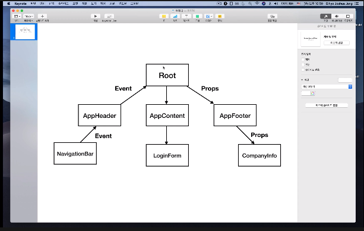
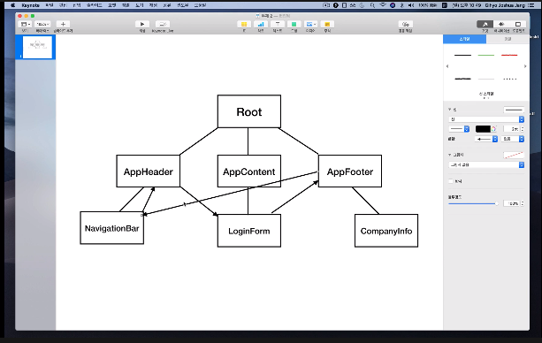

# Vue Component

- Component와 통신 방식 외 정리하였습니다.

## Vue Component란?

- 화면의 영역을 영역별로 구분해서 관리하는 것

  - header, side, content, footer 등

  - 장점: 재사용성을 올리기 위한 목적 

  ```
  // 부모 Component
  <div id="app">

    // 자식 Component
    <app-header></app-header>
    <app-content></app-content>
    
  </div>
  ```

### 전역 Component

- 실무에서는 대부분 Plugin이나 Library 형태로 전역으로 사용해야 하는 경우에만 사용한다.

  - Instance를 생성할 때마다 Root Component 안에 자동으로 해당 Component가 생성된다.

  - 형태

  ```
  Vue.component('컴포넌트 이름', 컴포넌트 내용) 

  <!-- 예시 -->
  Vue.component('app-header', {
    template:: "<h1>Header</h1>"
  })
  ```

### 지역 Component

- 객체 리터럴 방식으로 작업을 하고, 실무에서 거의 지역 컴포넌트를 사용한다.

  - 지역 Component를 사용하면 하단데 어떤 Component가 생성되었는지 알 수 있다.

  - Instance를 생성할 때마다 각각의 Component를 생성해야지 Root Component 내에서 보여진다.

  - 형태

  ```
  new Vue({
    key: {
      '키 === 컴포넌트 이름 ': '값 === 컴포넌트 내용'
    }
  })

  <!-- 예시 -->
  new Vue: ({
    el: '#app',
    components: {
      'app-header': {
        template: '<h1>header</h1>'
      }
    }
  })
  ```

## Vue Component 통신 방식

- Vue Component는 각각 고유한 데이터 유효범위를 갖는다.

  - 상위 컴포넌트 -> 하위 컴포넌트

    - props(data)를 전달하여 데이터를 내려준다.s

  - 하위 컴포넌트 -> 상위 컴포넌트

    - 이벤트가 발생하면 해당 이벤트를 상위로 올려준다.

  - 컴포넌트 통신 flow 이미지

    - props(data)가 아래로 흐르는 규칙이 생기면서, props의 흐름을 추적할 수 있다.

    - 아래에서 위로는 이벤트가 올라간다.

    

  - 기존의 데이터 전달 방식

    

### props(data)

- Root Component(상위)의 속성 값을 하위 Component에 내려주었을 경우

  - Root Component의 해당하는 속성 값(props 값)이 바뀌었을 때, 바뀐 props 값이 하위 Component에도 반영되어, 해당 값이 화면에서도 다시 그려진다.

   - Reactivity가 props에서도 반영이 된다.

  - 예시

  ```
  // html
  <div id="app">
    <!-- <app-content v-bind: props(data) 속성 이름 = "상위 컴포넌트의 데이터 이름"></app-content> -->
    <!-- props 속성 이름: app-content에 변수로 정의한다. -->
    <!-- 위 컴포넌트의 데이터 이름: app-content 기준으로 상위 컴포넌트는 Root, Root의 데이터 이름은 Instance의 data에 선언해둔, message이다. -->
    <app-content v-bind:propsdata="message"></app-content>
  </div>


  // js
  let appContent={
    // Root Component 에서 props(data) 값을 바꾸면, 화면에도 반영되어 실시간으로 변경된다.
    template: '<div>{{ propsdata }}</div>',

    //  props 속성 이름은, app-header에 변수로 정의한다.
    props: ['propsdata']
  }

  // Instance 생성
  new Vue({
    // instance를 만들고, 이 안에서 객체를 생성해서 el 이라는 element에 해당하는 태그에 인스턴스를 붙힌다.
    el: "#app",

    components: {
      'app-content': appContent
    },

    data: {
      message: 'hi',
      number: 10
    }
  })
  ```

### Event emit

- 하위 Component에서 발생한 Event가 상위 Component으로 Event를 올려주는 경우

  - 그 하위 Component 태그에서 해당 Event를 받아서 상위 Component에도 지정된 메서드를 실행시키면서 이벤트가 발생한다.

    - this.$emit : Vue에서 제공하는 API 기능이다.
  
  - 예시

  ```
  // html
  <div id="app">
    <p>{{ number }}</p>
    <!-- <app-content v-on:하위 component에서 발생한 Event 이름="상위 component의 메서드 이름"> -->
    <!-- 
          increase라는 하위 component event가 아래에서 올라왔을 때, 
          하위 component태그에서 해당 event를 받아서 increaseNumber 함으로써 
          이벤트를 발생시킨다. 
    -->
    <!-- button을 클릭했을 때 increase emit 이 실행되면서, increaseNumber 함수도 실행된다. -->
    <app-content v-on:increase="increaseNumber"></app-content>
  </div>


  // js
  let appContent = {
    // v-on:click 을 이용한 클릭 이벤트를 실행한다.
    // app-content 에서 Root로 이벤트를 올려 보낸다.
    // button click 했을 때 addEvent 함수를 실행한다.
    template: '<button v-on:click="addEvent">Add Number</button>',

    methods: {
      addEvent: function(){
        this.$emit('increase');
      }
    }
  }

  new Vue({
    el: '#app',

    components: {
      'app-content': appConctent
    }

    methods: {
      increaseNumber: function(){
        this.number = this.number + 1;
        console.log(this.number);
      }
    },

    data: {
      number: 10
    }
  })
  ``` 

  ### 같은 component 레벨 간의 통신 방법
