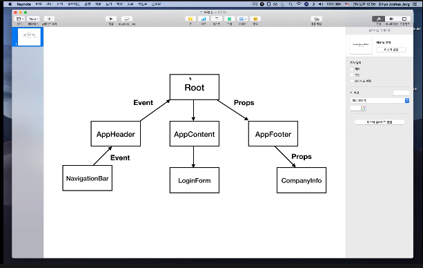
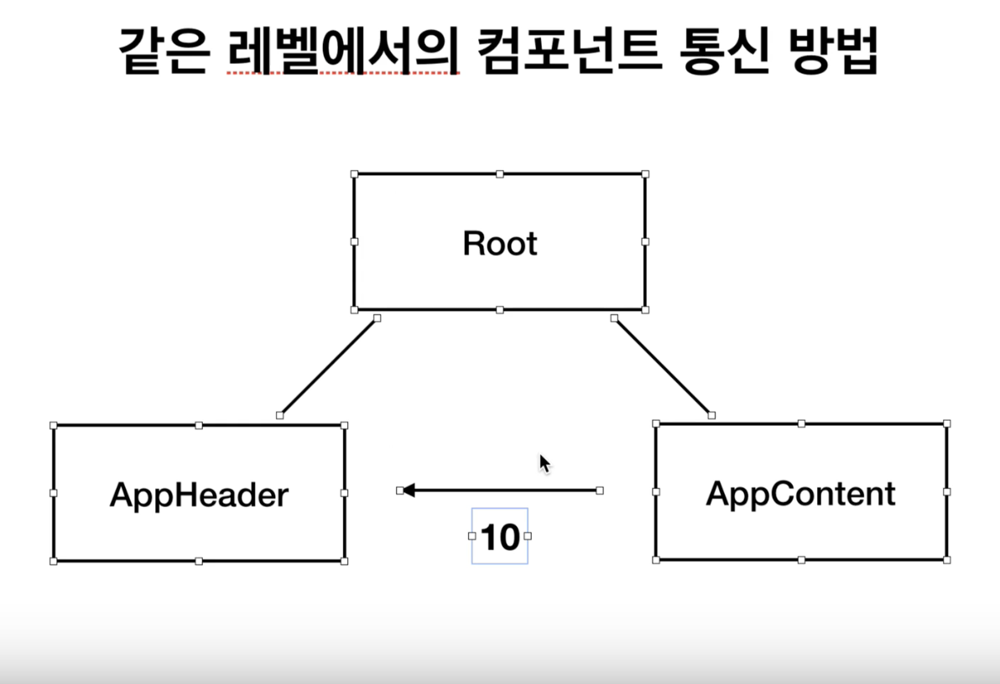
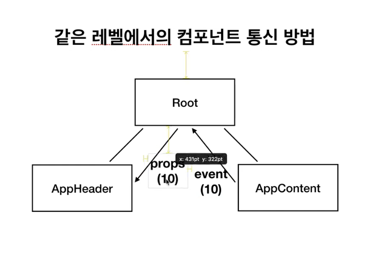
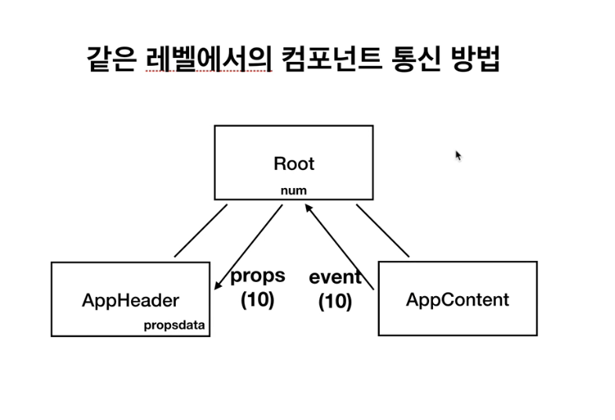
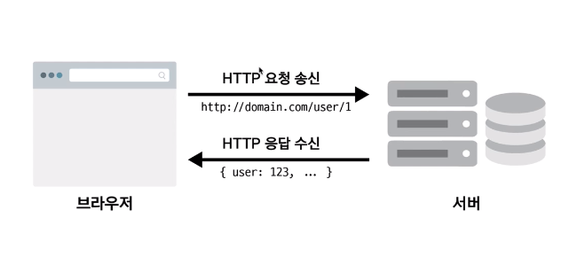
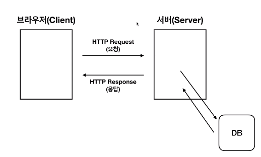

# Vue Component

- Component와 통신 방식 외 정리하였습니다.

## Vue Component란?

- 화면의 영역을 영역별로 구분해서 관리하는 것

  - header, side, content, footer 등

  - 장점: 재사용성을 올리기 위한 목적 

    ```
    // 부모 Component
    <div id="app">

      // 자식 Component
      <app-header></app-header>
      <app-content></app-content>
      
    </div>
    ```

### 전역 Component

- 실무에서는 대부분 Plugin이나 Library 형태로 전역으로 사용해야 하는 경우에만 사용한다.

  - Instance를 생성할 때마다 Root Component 안에 자동으로 해당 Component가 생성된다.

  - 형태

    ```
    Vue.component('컴포넌트 이름', 컴포넌트 내용) 

    <!-- 예시 -->
    Vue.component('app-header', {
      template:: "<h1>Header</h1>"
    })
    ```

### 지역 Component

- 객체 리터럴 방식으로 작업을 하고, 실무에서 거의 지역 컴포넌트를 사용한다.

  - 지역 Component를 사용하면 하단데 어떤 Component가 생성되었는지 알 수 있다.

  - Instance를 생성할 때마다 각각의 Component를 생성해야지 Root Component 내에서 보여진다.

  - 형태

    ```
    new Vue({
      key: {
        '키 === 컴포넌트 이름 ': '값 === 컴포넌트 내용'
      }
    })

    <!-- 예시 -->
    new Vue: ({
      el: '#app',
      components: {
        'app-header': {
          template: '<h1>header</h1>'
        }
      }
    })
    ```

## Vue Component 통신 방식

- Vue Component는 각각 고유한 데이터 유효범위를 갖는다.

  - 상위 컴포넌트 -> 하위 컴포넌트

    - props(data)를 전달하여 데이터를 내려준다.

  - 하위 컴포넌트 -> 상위 컴포넌트

    - 이벤트가 발생하면 해당 이벤트를 상위로 올려준다.

  - 컴포넌트 통신 flow 이미지

    - props(data)가 아래로 흐르는 규칙이 생기면서, props의 흐름을 추적할 수 있다.

    - 아래에서 위로는 이벤트가 올라간다.

    

  - 기존의 데이터 전달 방식

    

### props(data)

- Root Component(상위)의 속성 값을 하위 Component에 내려주었을 경우

  - Root Component의 해당하는 속성 값(props 값)이 바뀌었을 때, 바뀐 props 값이 하위 Component에도 반영되어, 해당 값이 화면에서도 다시 그려진다.

   - Reactivity가 props에서도 반영이 된다.

  - 예시

  ```
  // html
  <div id="app">
    <!-- <app-content v-bind: props(data) 속성 이름 = "상위 컴포넌트의 데이터 이름"></app-content> -->
    <!-- props 속성 이름: app-content에 변수로 정의한다. -->
    <!-- 위 컴포넌트의 데이터 이름: app-content 기준으로 상위 컴포넌트는 Root, Root의 데이터 이름은 Instance의 data에 선언해둔, message이다. -->
    <app-content v-bind:propsdata="message"></app-content>
  </div>


  // js
  let appContent={
    // Root Component 에서 props(data) 값을 바꾸면, 화면에도 반영되어 실시간으로 변경된다.
    template: '<div>{{ propsdata }}</div>',

    //  props 속성 이름은, app-header에 변수로 정의한다.
    props: ['propsdata']
  }

  // Instance 생성
  new Vue({
    // instance를 만들고, 이 안에서 객체를 생성해서 el 이라는 element에 해당하는 태그에 인스턴스를 붙힌다.
    el: "#app",

    components: {
      'app-content': appContent
    },

    data: {
      message: 'hi',
      number: 10
    }
  })
  ```

### Event emit

- 하위 Component에서 발생한 Event가 상위 Component으로 Event를 올려주는 경우

  - 그 하위 Component 태그에서 해당 Event를 받아서 상위 Component에도 지정된 메서드를 실행시키면서 이벤트가 발생한다.

    - this.$emit : Vue에서 제공하는 API 기능이다.
  
  - 예시

  ```
  // html
  <div id="app">
    <p>{{ number }}</p>
    <!-- <app-content v-on:하위 component에서 발생한 Event 이름="상위 component의 메서드 이름"> -->
    <!-- 
          increase라는 하위 component event가 아래에서 올라왔을 때, 
          하위 component태그에서 해당 event를 받아서 increaseNumber 함으로써 
          이벤트를 발생시킨다. 
    -->
    <!-- button을 클릭했을 때 increase emit 이 실행되면서, increaseNumber 함수도 실행된다. -->
    <app-content v-on:increase="increaseNumber"></app-content>
  </div>


  // js
  let appContent = {
    // v-on:click 을 이용한 클릭 이벤트를 실행한다.
    // app-content 에서 Root로 이벤트를 올려 보낸다.
    // button click 했을 때 addEvent 함수를 실행한다.
    template: '<button v-on:click="addEvent">Add Number</button>',

    methods: {
      addEvent: function(){
        this.$emit('increase');
      }
    }
  }

  new Vue({
    el: '#app',

    components: {
      'app-content': appConctent
    }

    methods: {
      increaseNumber: function(){
        this.number = this.number + 1;
        console.log(this.number);
      }
    },

    data: {
      number: 10
    }
  })

  ```   

### this

- 해당 객체를 가리킨다.

```
let obj = {
  num: 10,
  getNumber: const = () => {
    this.num + 1;
  }
}
```

## 동일 레벨에 있는 Component를 어떻게 통신을 할까.

- playground/component-same-level.html에서 확인! 






## Vue Router(라우터)

- 페이지를 이동할 때 사용하는 Vue 공식 라이브러리이자, 기능이다.

- 뷰 라이브러리를 이용해서 싱글 페이지 애플리케이션을 구현할 때 사용하는 라이브러리이다.

- [중급 라우터](https://joshua1988.github.io/web-development/vuejs/vue-router-navigation-guards/)

- CDN 방식이나, npm 방식으로 설치한다.

```
<script src="https://unpkg.com/vue-router/dist/vue-router.js"></script>
```

### 뷰 라우터 등록

```
<!-- router Instance 생성 -->
var Router = new VueRouter({
  // 라우터 옵션
})


<!-- Instance에 router Instance 등록 -->
new Vue ({
  el: '#app',

  router: Router
})
```
### 뷰 라우터 옵션

- routes: 라우팅 할 URL 과, 컴포넌트 값을 지정한다.

```
new VueRouter({
  <!-- URL의 해쉬 값 제거 속성(#) -->
  mode: 'history',
  <!-- 배열 형태로 담고, 객체 형태로 나열한다. -->
  routes: [
    {
      path: '/login',
      component: LoginComponent
    },
    {
      path: 'main',
      component: MainComponent
    }
  ]
})
```

## HTTP 라이브러리와 Ajax 그리고 Vue Resource

- 뷰에서 권고하는 HTTP 통신 라이브러리이다.

- Promise based HTTP client for the browser and node.js

- Promise 기반의 HTTP 통신 라이브러리 이자 node.js

  - js의 비동기 처리 패턴

    1. [callback](https://joshua1988.github.io/web-development/javascript/javascript-asynchronous-operation/)

    2. [promise](https://joshua1988.github.io/web-development/javascript/promise-for-beginners/)

    3. promise + generator

    4. [async & await](https://joshua1988.github.io/web-development/javascript/js-async-await/)

- 문서화가 잘 되어있고 다양한 API를 내장하고 있다.

- https://github.com/axios/axios

### Vue Resource (axios 사용 이전)

- pagekit사의 Vuejs에서 활용할 수 있는 라이브러리이고 오래 됨

- [Vue-Resource](https://github.com/pagekit/vue-resource)

### Ajax

- Javascript 라이브러리 중 하나이며, 비동기적인 웹 애플리케이션의 제작을 할 때 사용한다.

- 브라우저가 가지고 있는 CMLHttpReauest 객체를 이용해서 전체 페이지를 새로 고치지 않고, 페이지의 일부만을 위한 데이터를 로드하는 기법으로, Javascript를 사용한 비동기 통신, 클라이언트와 서버간에 XML 데이터를 주고받는 기술이다.

- 즉, 자바스크립트를 통해서 서버에 데이터를 요청하는 것이다.

  - 비동기 방식이란? 

    - 기존 페이지의 리로드의 경우 전체 리소스를 다 불러와야 하는데 (이미지, 스크립트, 기타 코드 등) 이럴 경우, 불필요한 리소스 낭비가 발생하게 되지만, 비동기식 방식을 이용할 경우 필요한 부분만 불러와 사용할 수 있으므로 속도가 빠르다는 큰 장점이 있다. 

    - Jquery.ajax -> 데이터를 호출하고, 받아오고, 수정하는 등등의 일을 한다.

- **Ajax로 할 수 있는 것**

  - 클라이언트에서 서버로 데이터를 요청하고, 그에 대한 결과를 돌려받을 수 있다.

  - 클라이언트? 서버에서 정보를 가져와서 사용자에게 보여줄 수 있고, 사용자와 상호작용을 할 수 있는 소프트웨어

  - 서버? 네트워크 상에서 접근할 수 있는 프로그램으로 어떤 자료들에 대한 관리나 접근을 제어해주는 프로그램

- **Ajax 를 사용하는 이유**

  - 단순하게 무언가를 부르거나 데이터를 조회하고 싶을 경우, 페이지 전체를 새로고침하지 않기 위해서 사용한다고 볼 수 있다.

  - Ajax는 HTML 페이지 전체가 아닌, 일부분만 갱신할 수 있도록 XMLHttpRequest 객체를 통해 서버에 request 한다. 이 경우 JSON이나 XML 형태로 필요한 데이터만 받아 갱신하기 때문에 그만큼의 자원과 시간을 아낄 수 있다.

- **Ajax 장점**

  - 웹페이지의 속도 향상
  
  - 서버의 처리가 완료될 때까지 기다리지 않고 처리가 가능

  - 서버에서 DATA만 전송하면 되므로 전체적인 코딩의 양이 줄어든다.

  - 기존 웹에서는 불가능했던 다양한 UI가 가능하다. (Flickr의 경우, 사진의 제목이나 태그를 페이지의 리로드 없이 수정할 수 있다.)

- **Ajax 단점**

  - 히스토리 관리가 되지 않는다.

  - 페이지 이동없는 통신으로 인한 보안상의 문제가 있다.

  - Ajax를 쓸 수 없는 브라우저 이슈가 있음

- **Ajax 진행 과정**

  1. XMLHttpRequest Object를 만든다.

    - request를 보낼 준비를 브라우저에게 시키는 과정
    
    - 이것을 위해서 필요한 method를 갖춘 object가 필요함
  
  2. callback 함수를 만든다.
    
    - 서버에서 response가 왔을 때 실행시키는 함수
    
    - HTML 페이지를 업데이트 함
    
  3. Open a request
    
    - 서버에서 response가 왔을 때 실행시키는 함수
    
    - HTML 페이지를 업데이트 함
    
  4. send the request

### 전반적인 웹 서비스 구조 

- 클라이언트와 서버간에 데이터를 주고받기 위한 규칙. 약속 




1. 브라우저(Client) -> 서버(Server)

  - HTTP 요청(Request)

2. 서버(Server) -> DB

  - 요청에 의해서 서버에서 특정 백앤드 로직을 통해(Jave,nodeJS, 장고) DB에게 정보를 요청한다.

  - DB에서 요청한 데이터를 서버에게 전달해준다.

3. 서버(Server) -> 브라우저(Client)

  - HTTP 응답(Response)

### 크롬 개발자 도구 네트워크 패널

- 클라이언트에서 HTTP 요청에서 axios로 보내보자.

1. 네트워크 패널 -> XHR 탭을 클릭하고

2. get user button을 클릭하면 name에 users/ 가 뜨고, headers 를 확인해보자

  1. headers - http의 정보(응답, 부가적인 정보)를 담는다.

    - General 

      - Request URL 을 GET으로 보냈고 200코드(정상, 성공)로 데이터를 받았다.

    - Responsee header

    - Request Headers

  2. Preview, Response

    - GET으로 받아온 정보를 볼 수 있다.

- [HTTP 프로토콜](https://joshua1988.github.io/web-development/http-part1/)


