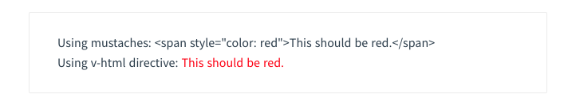
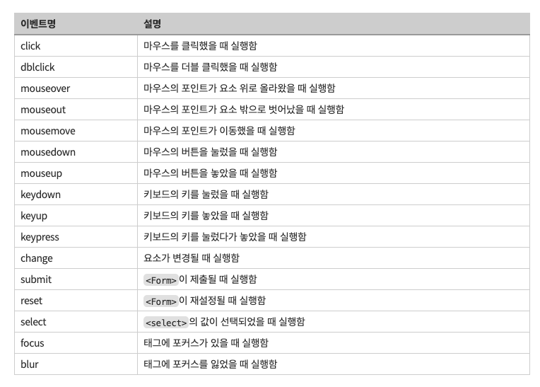

# 템플릿 문법 

- 뷰로 화면을 조작하는 방법을 템플릿 문법이라고 하는데, 데이터 바인딩과 디렉티브 방법이 있다.

- Vue.js는 렌더링 된 DOM을 기본 Vue 인스턴스의 데이터에 선언적으로 바인딩할 수 있는 HTML 기반 템플릭 구문을 사용한다.

- 모든 Vue.js템플릿은 스펙을 호환하는 브라우저 및 HTML파서로 구문 분석 할 수 있는 유효한 HTML이다.

- 내부적으로 Vue는 템플릿을 가상 DOM 렌더링 함수로 컴파일을 한다.

  - 쉽게 말해, 실제 화면에 보일 HTML의 틀로, 정해진 룰에 의해 해석되는 HTML 문서이다. 

  - 템플릿 문법을 사용하면, 만들어진 데이터를 이용해 템플릿 블럭 내에 DOM 조작이 가능하고, 주로 디렉티브로 이루어져 DOM 엘리먼트에 속성을 추가할 수 있다.

## 보간법: 위치 지정자 

### Mustache

- 이중 중괄호를 사용해서 가장 쉽게 데이터 바인딩을 할 수 있는 문법으로, html 속성에서는 사용할 수 없다.

- Mustache 태그는 해당 데이터 객체의 msg 속성 값으로 대체된다. 또한 데이터 객체의 msg 속성값이 변경될 때 마다 자동 갱신이 된다.

```
<span>메시지: {{ msg }} </span>
```

### 원시 HTML

- 이중 중괄호(Mustache)는 HTML이 아닌 일반 텍스트로 데이터를 해석한다. 실제 HTML을 출력하려면 v-html 디렉티브를 사용해야 한다.

```
<p>Using Mustache: {{rowHtml}} </p>
<p>Using v-html directive: <span v-html="rowHtml"></span></p>
```



- span의 내용은 rawHtml으로 대체된다. 이 때 데이터 바인딩은 무시된다.

- Vue는 문자열 기반 템플릿 엔진이 아니기 때문에 v-html을 이용해서 템플릿을 사용할 수 없다.

- 이와달리 컴포넌트는 UI 재사용 및 구성을 위한 기본 단위로 사용하는 것을 추천한다.

### 속성

- 이중 중괄호는 HTML 속성을 사용할 수 없으므로, v-bind 디렉티브를 사용한다.

```
<div v-bind:id="dynamivId"></div>
```

- boolean 속성을 사용할 때 단순히 true인 경우 v-bind는 조금 다르게 작동한다.

```
<button v-bind:disabled="isButtonDisabled">Button</button>
```

- isButtonDisabled가 null, undefined 또는 false의 값을 가지면 disabled 속성은 렌더링 된 button 엘리먼트에 포함되지 않는다.

### Javascript 표현식 사용

- 실제로 Vue.js는 모든 데이터 바인딩 내에서 Javascript 표현식의 모든 기능을 지원한다.

- 각 바인딩에 하나의 단일 표현식만 포함될 수 있다!!

```
{{number + 1}}

{{ ok ? 'YES' : 'NO }}

{{ massage.splirt('').reverse().jotin('') }}

<div v-bind:id="'list-" + id></div>

<!-- 아래는 구문입니다, 표현식이 아닙니다. -->
{{ var a = 1 }}

<!-- 조건문은 작동하지 않습니다. 삼항 연산자를 사용해야 합니다. -->
{{ if (ok) { return message } }}
```
## 데이터 바인딩

- Vue 인스턴스의 데이터를 연결하는 것을 의미한다.

- Mustache, v-text, v-html, v-bind, v-show 등이 있다.

- Vue 인스턴스 내부에 data 객체를 사용해서 데이터를 담아준다.

### data

- Vue의 여러 속성 중, data는 해당 Vue 인스턴스에서 사용할 정보들을 저장 및 선언해주는 역할을 한다.

- Object 형태로 정보들을 가지고 있다.

### 디렉티브

- 디렉티브는 v- 접두사가 있는 특수 속성으로, 속성 값은 단일 Javascript 표현식이 된다.

- 디렉티브의 역할은 표현식의 값이 변경될 때 사이드 이펙트를 반응적으로 DOM에 적용한다.

- **즉, 변경 내용이 실시간으로 반영된다!!**

```
<p v-if="seen">이제 나를 볼 수 있어요</p>
```

#### v-text

- Mustache와 비슷하게 작동을 하고, 중괄호 대신 디렉티브를 이용해서 데이터를 바인딩 한다.

```
<div id="app">
  <span v-text="message"></span>
</div>

<script>
  new Vue({
    el: '#app',
    data: {
      message: 'hello'
    }
  })
</script>


```

#### v-bind

- 디렉티브는 반응적으로 HTML 속성을 갱신하는 데에 사용된다.

```
<a v-bind:href="url">...</a>
```

- 위 예에서 href는 전달 인자로, 엘리먼트의 href 속성을 표현식 url의 값에 바인드하는 v-bind 디렉티브에게 알려준다.

#### v-if

- 디렉티브는 if else와 동등한 목적으로 사용된다.

- v-if는 조건에 해당하지 않으면 렌더링을하지 않아서 보여지지 않는다.

- v-else는 앞의 조건이 성립하지 않는다면, else 조건이 동작한다.

```
<div id="app">
  <div v-if="loading">loading</div>
  <div v-else>loding clear!</div>
</div>

<script>
new Vue ({
  el: '#app',
  data: {
    loading: true;
  }
})
</script>
```

#### v-show

- 표현식이 참일 경우에 보여지는데, 참이지 않을 경우에는 display: none; 스타일링으로 보여주지 않는다. (v-if랑 차이점)

#### v-model (양방향 데이터 바인딩)

- form의 value 값을 가지고 있는 경우에 사용한다.

  - input, select, textarea 등의 component에 사용하고, 입력된 값을 가져온다.

- state값을 꼭 사용해야 하고, props로 내려받은 값을 바로 v-model에서 사용할 수 없다.

```
<div id="app">
  <input v-model="message" placeholder="입력하세요">
  <p> {{ message }}</p>
</div>

<script>
  new Vue({
    el: '#app',
    data: {
      message: ''
    }
  })
</script>
```

## 이벤트 핸들링 

- v-on 디렉티브를 사용해서 DOM 이벤츠를 처리한다.

- 이벤트 핸들링?

  - 웹페이지에서 하는 모든 동작, keypress, mousemove, resize, click 등 



### methods

- 버튼의 클릭 이벤트 발생 시 설정한 함수가 실행되도록 해야하는데, 이 함수는 Vue 인스턴스 내부에 위치해 있다. 

- 함수들을 저장하는 곳이라고 생각하면 된다.

- 뷰 인스턴스에서 사용 할 데이터들을 data안에 넣은 것 처럼, 함수를 만들어서 뷰 인스턴스의 methods 안에 넣으면 된다!!

### 디렉티브

#### v-on

- 디렉티브는 DOM 이벤트를 듣고, 트리거 될 때 JS를 실행한다.

- v-on:{event행위} = "자바스크립트 표현식"

```
<div id="app">
  <button v-on:click="greet">Greet</button>
</div>

new Vue({
  el: '#app',
  data: {
    name: 'minyoung'
  },

  <!--  mothds 객체 안에 정의한다. -->
  methods: {
    greet: function(event){
      <!-- 메소드 안에서 사용하는 this는 Vue 인스턴스 자신을 가리킨다. -->
      alert('Hello' + this.name+ '!')

      <!-- event 는 네이비트 DOM 이벤트다. -->
      if(event){
        alert(event.target.tagName)
      }

    }
  }
})
```

#### 이벤트 수식어

- JS 구현을 간단히 처리하기 위해서 수식어를 사용할 수 있다.

  - v-on:click.prevent="goodgood"

- .stop

- .prevent

- .capture

- .self

- .once

- .passive

```
<!-- 클릭 이벤트 전파가 중단됩니다 -->
<a v-on:click.stop="doThis"></a>

<!-- 제출 이벤트가 페이지를 다시 로드 하지 않습니다 -->
<form v-on:submit.prevent="onSubmit"></form>

<!-- 수식어는 체이닝 가능합니다 -->
<a v-on:click.stop.prevent="doThat"></a>

<!-- 단순히 수식어만 사용할 수 있습니다 -->
<form v-on:submit.prevent></form>

<!-- 이벤트 리스너를 추가할 때 캡처모드를 사용합니다 -->
<!-- 즉, 내부 엘리먼트를 대상으로 하는 이벤트가 해당 엘리먼트에서 처리되기 전에 여기서 처리합니다. -->
<div v-on:click.capture="doThis">...</div>


<!-- event.target이 엘리먼트 자체인 경우에만 트리거를 처리합니다 -->
<!-- 자식 엘리먼트에서는 안됩니다 -->
<div v-on:click.self="doThat">...</div>
```

## 참고

- [Vue-data](https://medium.com/@hozacho/%EB%A7%A8%EB%95%85%EC%97%90-vuejs-8a50055b7551)

- [Vue-methods](https://medium.com/@hozacho/%EB%A7%A8%EB%95%85%EC%97%90-vuejs-002-vuejs-methods-b3d92ad255bf)

- [공식 문서](https://kr.vuejs.org/v2/guide/syntax.html)

- https://willbfine.tistory.com/427

- https://velopert.com/3148